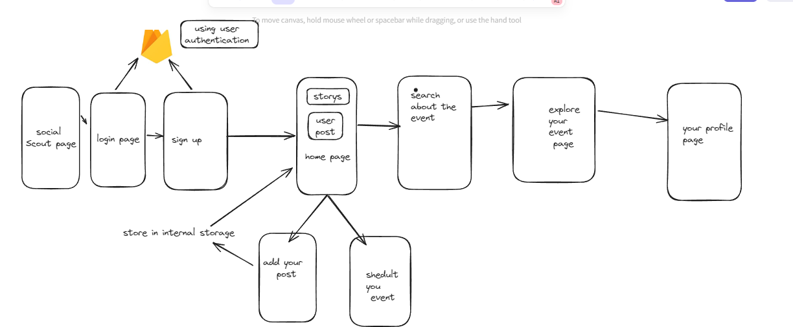
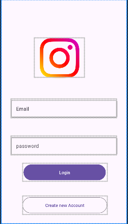
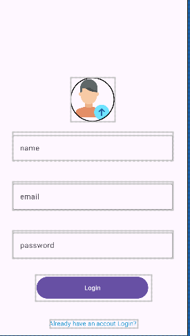
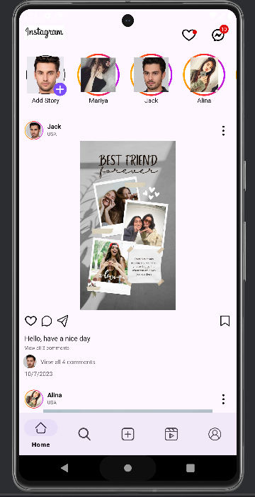
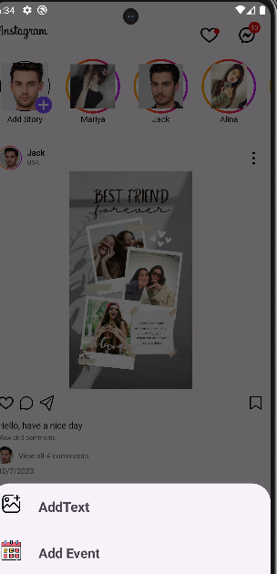
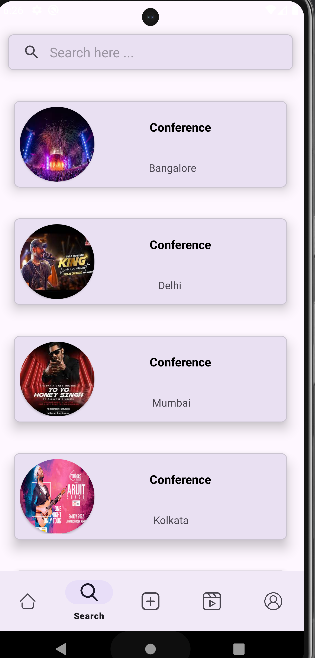
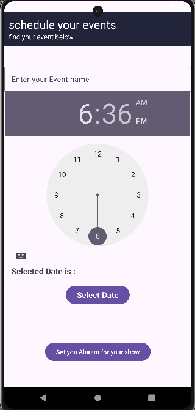
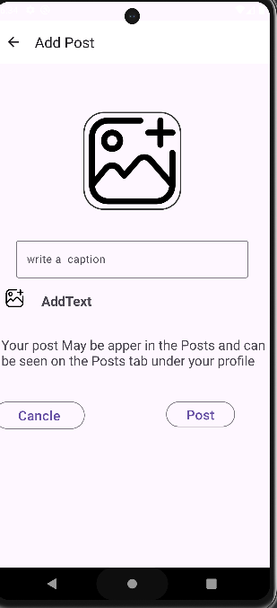

# Social Scout


Welcome to Social Scout, your go-to platform for seamless social interaction and event management. With Social Scout, you can explore, engage, and organize your social life like never before. Let's dive into what makes Social Scout your ultimate companion for all things social.

## Introduction
In the age of digital connectivity, Social Scout emerges as a beacon for seamless social interaction and event management. This project, developed using Kotlin and XML, aims to revolutionize the way we engage with social media and organize events.

## Project Workflow
Social Scout encompasses a streamlined workflow designed to enhance user experience and efficiency. From user registration/login to event creation and exploration, the project workflow ensures seamless navigation and interaction within the app.


## Features
- **Exploring Social Connectivity:** Seamlessly navigate through a unified feed aggregating posts and stories from various social media platforms.
- **Personalized Event Management:** Create, schedule, and manage events with ease, all within the app's intuitive interface.
- **Empowering Engagement:** Share posts and updates, control privacy settings, and engage with fellow users effortlessly.
- **Seamless Integration:** Built on Kotlin and XML, Social Scout offers compatibility and scalability across platforms, ensuring a smooth user experience.
## preview of the app 
   
   
     
    
## Contributing

We welcome contributions from the community to enhance and improve Social Scout. If you have ideas for new features, bug fixes, or any other improvements, feel free to submit a pull request. Together, let's make Social Scout the best it can be!

### Steps to Contribute:

1. **Fork the Repository:**
   - Start by forking the Social Scout repository to your GitHub account. This creates a copy of the repository under your account where you can make changes.

    ```bash
    git clone https://github.com/your-username/social-scout.git
    ```

2. **Create a Branch:**
   - Before making any changes, create a new branch to work on your contributions. Use a descriptive branch name that reflects the changes you intend to make.

    ```bash
    git checkout -b feature-name
    ```

3. **Make Changes:**
   - Implement the changes or additions you wish to contribute to the project. This could include adding new features, fixing bugs, updating documentation, or improving existing code.

4. **Test Your Changes:**
   - Test your changes thoroughly to ensure they work as intended and do not introduce any regressions or errors.

5. **Commit Your Changes:**
   - Once satisfied with your changes, commit them to your local repository.

    ```bash
    git add .
    git commit -m "Add feature-name"
    ```

6. **Push Changes to GitHub:**
   - Push your committed changes to your forked repository on GitHub.

    ```bash
    git push origin feature-name
    ```

7. **Submit a Pull Request (PR):**
   - Once your changes are pushed to your forked repository, navigate to the original Social Scout repository on GitHub.
   - Click on the "Pull Request" button to create a new pull request.
   - Select the branch containing your changes and provide a brief description of the contributions you're making.

8. **Review and Collaborate:**
   - Collaborate with the project maintainers and other contributors by addressing any feedback or suggestions provided during the review process.

9. **Merge Your Pull Request:**
   - Once your pull request has been reviewed and approved by the project maintainers, it will be merged into the main branch of the Social Scout repository.

    Congratulations! Your contributions are now part of the Social Scout project.


